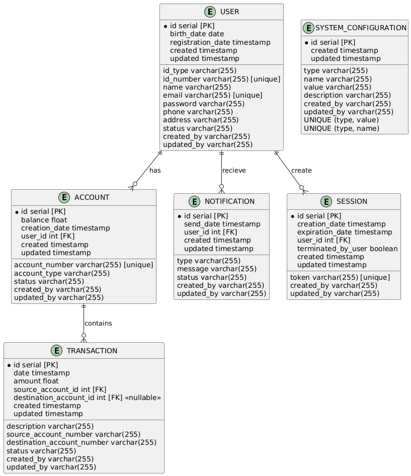

## Índice

0. [Ficha del proyecto](#0-ficha-del-proyecto)
1. [Descripción general del producto](#1-descripción-general-del-producto)
2. [Arquitectura del sistema](#2-arquitectura-del-sistema)
3. [Modelo de datos](#3-modelo-de-datos)
4. [Especificación de la API](#4-especificación-de-la-api)
5. [Historias de usuario](#5-historias-de-usuario)
6. [Tickets de trabajo](#6-tickets-de-trabajo)
7. [Pull requests](#7-pull-requests)

---

## 0. Ficha del proyecto
 
### **0.1. Nombre completo:**  

Cesar Augusto Viasus Cifuentes

### **0.2. Nombre del proyecto:**  

Spark Bank

### **0.3. Descripción breve del proyecto:**
SparkBank es un neobanco digital que ofrece soluciones financieras innovadoras y accesibles para usuarios que buscan gestionar sus finanzas de manera eficiente y segura. A través de su plataforma intuitiva y servicios automatizados, SparkBank permite a sus clientes realizar transacciones, administrar cuentas bancarias, recibir notificaciones en tiempo real y disfrutar de una experiencia bancaria sin las limitaciones tradicionales. El enfoque principal de SparkBank es brindar accesibilidad, velocidad y transparencia, empoderando a sus usuarios con herramientas financieras modernas.


### **0.4. URL del proyecto:**
[https://sparkbank-cv.onrender.com/](https://sparkbank-cv.onrender.com/)


### 0.5. URL o archivo comprimido del repositorio

[https://github.com/caviasusc-advance/AI4Devs-finalproject](https://github.com/caviasusc-advance/AI4Devs-finalproject)


---

## 1. Descripción general del producto

### **1.1. Objetivo:**

Nuestro propósito se centra en transformar la manera en que las personas manejan sus finanzas, brindándoles una experiencia bancaria moderna, accesible y personalizada. Queremos empoderar a nuestros clientes para que tomen el control de su bienestar financiero con herramientas innovadoras y sencillas de usar.
- Valor que Aporta:
  - Empoderamiento Financiero: SparkBank ofrece a los usuarios una plataforma que simplifica la gestión financiera, desde la apertura de cuentas hasta la inversión, permitiéndoles tomar decisiones informadas.
  - Accesibilidad y Conveniencia: Con un enfoque 100% digital, SparkBank elimina las barreras tradicionales del sistema bancario, ofreciendo servicios financieros a cualquier persona, en cualquier lugar y en cualquier momento.
- Problemas que Soluciona:
  - Complejidad Bancaria: SparkBank reduce la complejidad del manejo financiero, ofreciendo una interfaz intuitiva y procesos simplificados que permiten a los usuarios manejar sus cuentas sin complicaciones.
  - Falta de Inclusión Financiera: Al ser una plataforma digital, SparkBank elimina la necesidad de sucursales físicas, brindando acceso a servicios bancarios a personas que tradicionalmente han sido excluidas del sistema financiero.
  - Transparencia: En un entorno donde los usuarios a menudo desconfían de las instituciones financieras tradicionales, SparkBank se distingue por su transparencia en tarifas, condiciones y políticas, creando un entorno de confianza.
- Público Objetivo:
  - Jóvenes Profesionales y Emprendedores: Aquellos que buscan una solución bancaria moderna que se alinee con su estilo de vida digital y que les permita manejar sus finanzas de manera eficiente.
  - Usuarios Subbancarizados o No Bancarizados: Personas que no tienen acceso a los servicios bancarios tradicionales o que desean una alternativa más flexible y accesible.
  - Personas con Mentalidad Digital: Clientes que valoran la conveniencia de gestionar sus finanzas desde sus dispositivos móviles, sin la necesidad de interactuar con bancos físicos.

### **1.2. Características y funcionalidades principales:**

1. Apertura de Cuenta 100% Digital:
Proceso Simplificado: Permitir a los usuarios abrir una cuenta en minutos, sin papeleo, utilizando verificación de identidad digital (KYC) y firma electrónica.
Acceso Inmediato: Una vez abierta la cuenta, el usuario debe poder empezar a operar de inmediato, con acceso a una tarjeta virtual para compras online.
2. Banca Móvil y Web de Alta Usabilidad:
Interfaz Intuitiva: Una app y plataforma web con un diseño limpio y fácil de navegar, que permita a los usuarios realizar todas sus operaciones bancarias desde su móvil o computadora.
Gestión Multicuenta: Posibilidad de crear y gestionar múltiples cuentas, como cuentas corrientes, de ahorro, e incluso cuentas para diferentes propósitos financieros.
3. Integración con Pagos y Transferencias:
Pagos P2P y QR: Facilitar transferencias instantáneas a otros usuarios y pagos en comercios mediante códigos QR.
Pagos Internacionales: Ofrecer transferencias internacionales con comisiones transparentes y competitivas.
Compatibilidad con Apple Pay/Google Pay: Permitir a los usuarios agregar sus tarjetas SparkBank a sus billeteras digitales para pagos rápidos y seguros.
4. Seguridad y Protección del Usuario:
Autenticación Multifactor: Uso de autenticación biométrica (huella digital, reconocimiento facial) y tokens de autenticación para garantizar la seguridad.
Protección contra Fraude: Monitoreo en tiempo real para detectar transacciones sospechosas y alertar al usuario inmediatamente.
Seguro de Depósitos: Garantizar que los fondos de los usuarios estén asegurados hasta cierto límite en caso de insolvencia de la entidad.
5. Integraciones y Open Banking:
APIs Abiertas: Ofrecer APIs para que los usuarios integren sus cuentas con otros servicios financieros, como aplicaciones de contabilidad, planificación financiera o pagos de facturas.
Conectividad con Otros Bancos: Permitir la agregación de cuentas de otros bancos dentro de la app de SparkBank para una visión completa del estado financiero del usuario.

### **1.3. Diseño y experiencia de usuario:**

> Proporciona imágenes y/o videotutorial mostrando la experiencia del usuario desde que aterriza en la aplicación, pasando por todas las funcionalidades principales.

### **1.4. Instrucciones de instalación:**
En la raiz del proyecto iniciar la base de datos usando  ```docker compose up -d```
Editar .env con las credenciales de la base de datos

**Configuración del Backend**

```
cd backend
npm install
# Editar .env con las credenciales de la base de datos
npm migrate
npm seed
npm start
```

**Configuración del Frontend**

```
cd ../frontend
npm install
# Editar .env con la URL de la API backend
npm run dev
```

**Testing**
- backend: ```npm test```
- frontend: ```npm run cy:open```


---

## 2. Arquitectura del Sistema

### **2.1. Diagrama de arquitectura:**


### **2.2. Descripción de componentes principales:**

1. **Aplicación Web (WebApp)**
Tecnología: React.js
Descripción: La interfaz de usuario que permite a los clientes y administradores interactuar con SparkBank. Los clientes pueden gestionar sus cuentas, realizar transacciones, revisar saldos y acceder a otras funcionalidades financieras. Los administradores pueden supervisar y gestionar operaciones bancarias y usuarios.
Rol: Punto de acceso principal para la interacción del usuario final con el sistema.
2. **Backend API (apiBackend)**
Tecnología: Node.js con Express
Descripción: El servidor que maneja la lógica de negocio, el procesamiento de transacciones, la autenticación y la autorización de usuarios, y el acceso a datos. Actúa como intermediario entre la aplicación web y los otros servicios, como la base de datos y el cache.
Rol: Centraliza el procesamiento de solicitudes, maneja la lógica de negocio y se comunica con otros componentes del sistema.
3. **Base de Datos (Database)**
Tecnología: PostgreSQL
Descripción: Sistema de gestión de bases de datos relacional que almacena información persistente, como datos de usuarios, cuentas, transacciones y otros datos críticos para el funcionamiento del neobanco.
Rol: Almacenamiento seguro y estructurado de datos.
### **2.3. Descripción de alto nivel del proyecto y estructura de ficheros**

LA estructura basica del proyecto es la siguiente:

```
root/
├── backend/
│   ├── src/
│   │   ├── controllers/
│   │   ├── models/
│   │   ├── db/
│   │   │   ├── knex.js
│   │   ├── index.js
│   │   └── routes/
│   ├── tests/
│   ├── .env
│   ├── db/
│   │   └── migrations/
│   │   └── seeds/
│   |   ├── knexfile.js
│   ├── package.json
├── frontend/
│   ├── src/
│   │   ├── components/
│   │   │   └── layout/
│   │   │   └── ui/
│   │   ├── hooks/
│   │   ├── lib/
│   │   │   ├── constants.js
│   │   │   └── http.js
│   │   ├── navigation/
│   │   |   └── Routes.jsx
│   │   ├── screens/
│   │   ├── App.css
│   │   ├── App.jsx
│   │   ├── main.jsx
│   ├── cypress/
│   │   ├── e2e/
│   │   └── support/
│   ├── .env
│   ├── package.json
└── README.md
```

**Propósito de las Carpetas Principales**
**Backend**
- src/: Contiene el código fuente del backend.
  - controllers/: Contiene los controladores que manejan las solicitudes HTTP. Ejemplos: accountController.js, userController.js.
  - models/: Contiene los modelos que representan las entidades de la base de datos. Ejemplos: Account.js, User.js.
  - db/: Contiene la configuración de la base de datos.
    - knex.js: Configuración de Knex.js para la conexión a la base de datos.
  - index.js: Punto de entrada principal del servidor backend.
  - routes.js: Define las rutas de la API.
- db/: Contiene la configuración de la base de datos para migraciones y semillas.
    - knexfile.cjs: Configuración de Knex.js para la conexión a la base de datos.
    - migrations/: Contiene los archivos de migración para la base de datos.
    - seeds/: Contiene los archivos de semillas para poblar la base de datos con datos iniciales.
- tests/: Contiene las pruebas unitarias y de integración para el backend. Ejemplos: accountController.test.js, userController.test.js.
- .env: Archivo de configuración de variables de entorno.

**Frontend**
- src/: Contiene el código fuente del frontend.
  - components/: Contiene los componentes reutilizables de la interfaz de usuario.
    - ui/: Componentes de la interfaz de usuario como botones, tarjetas, entradas de texto, etc.
    - layout/: Componentes de la interfaz de usuario para manejar LA autenticación
  - screens/: Contiene las pantallas principales de la aplicación. Ejemplos: Signin.jsx, Home.jsx.
  - lib/: Contiene utilidades y constantes compartidas. Ejemplos: constants.js, http.js.
  - navigation:
    - Routes.jsx: Define las rutas de la aplicación frontend.
  - App.jsx: Componente principal de la aplicación.
  - main.jsx: Punto de entrada principal del frontend.
- cypress/: Contiene las pruebas E2E (end-to-end) para el frontend.
- .env: Archivo de configuración de variables de entorno.
- Demas archivos de configuración

### **2.4. Infraestructura y despliegue**

El código fuente se encuentra en un repositorio de github. El repositorio se encuentra conectado a un entorno de [Render](https://render.com/). Alli se aloja en sitio estatico construido en React, un servicio web hecho en NodeJS con Express y una base de datos PostgreSQL


### **2.5. Seguridad**

En el proyecto SparkBank, se han implementado varias prácticas de seguridad importantes. A continuación, se describen las principales prácticas de seguridad:
1. **Hashing de Contraseñas**
En el método logInUser, se utiliza la biblioteca bcrypt para comparar la contraseña proporcionada por el usuario con la contraseña almacenada en la base de datos. Esto asegura que las contraseñas no se almacenen en texto plano, sino que se almacenen como hashes seguros.
2. **Generación de Tokens JWT**
Se utiliza jsonwebtoken para generar tokens JWT (JSON Web Tokens) que contienen información del usuario. Estos tokens se firman con una clave secreta (process.env.TOKEN_SECRET) y tienen una expiración de 1 hora. Esto ayuda a asegurar que las sesiones de usuario sean temporales y que los tokens no puedan ser fácilmente falsificados.
3. **Cookies HTTPOnly**
Los tokens JWT generados se almacenan en cookies con la opción httpOnly habilitada. Esto significa que las cookies no son accesibles a través de JavaScript en el navegador, lo que ayuda a proteger contra ataques de Cross-Site Scripting (XSS).

### **2.6. Tests**
**Test**: should create a new account successfully
Este test verifica que se puede crear una nueva cuenta exitosamente. Los pasos que sigue son:
1. Preparación de Datos: Se define un objeto newAccount con los datos necesarios para crear una cuenta.
2. Mock de Funciones: Se configuran los mocks de las funciones insert, where, first y returning de knex para simular la inserción y recuperación de datos en la base de datos.
3. Solicitud HTTP: Se envía una solicitud POST al endpoint /accounts con los datos de newAccount.
4. Verificación de Respuesta: Se verifica que la respuesta tenga un estado 201 (creado) y que el cuerpo de la respuesta contenga las propiedades esperadas (account_number, account_type, balance).

**Test**: should return an error if account number generation fails
Este test verifica que se retorna un error si la generación del número de cuenta falla. Los pasos que sigue son:
1. Preparación de Datos: Se define un objeto newAccount con los datos necesarios para crear una cuenta.
2. Mock de Funciones: Se configuran los mocks de las funciones insert, where y first de knex para simular la inserción y recuperación de datos en la base de datos.
3. Simulación de Error: Se usa jest.spyOn para simular que Math.random siempre retorna un valor que causa la falla en la generación del número de cuenta.
4. Solicitud HTTP: Se envía una solicitud POST al endpoint /accounts con los datos de newAccount.
5. Verificación de Respuesta: Se verifica que la respuesta tenga un estado 400 (error) y que el cuerpo de la respuesta contenga una propiedad error.
6. Restauración de Math.random: Se restaura la función original de Math.random.
---

## 3. Modelo de Datos

### **3.1. Diagrama del modelo de datos:**




### **3.2. Descripción de entidades principales:**

#### Entidades
**Usuario**

- Descripción: La entidad "Usuario" representa a los clientes de SparkBank. Contiene la información personal necesaria para identificar y autenticar al usuario, como su nombre, dirección, correo electrónico, teléfono, tipo y número de identificación, y otros detalles importantes.
- Atributos Clave:
  - id: Identificador único del usuario (PK).
  - id_type: Tipo de identificación del usuario.
  - id_number: Número de identificación del usuario (único).
  - name: Nombre del usuario.
  - email: Correo electrónico del usuario (único).
  - password: Contraseña cifrada del usuario.
  - phone: Número de teléfono del usuario.
  - address: Dirección del usuario.
  - birth_date: Fecha de nacimiento del usuario.
  - registration_date: Fecha de registro del usuario.
  - status: Estado del usuario.

**Cuenta**

- Descripción: La entidad "Cuenta" representa las cuentas bancarias de los usuarios. Cada cuenta está asociada a un único usuario y contiene información financiera relevante como el tipo de cuenta, saldo, y su estado.
- Atributos Clave:
  - id: Identificador único de la cuenta (PK).
  - account_number: Número de cuenta (único).
  - account_type: Tipo de cuenta.
  - balance: Saldo de la cuenta.
  - creation_date: Fecha de creación de la cuenta.
  - status: Estado de la cuenta.
  - user_id: Identificador del usuario propietario de la cuenta (FK).

- Relación:
Un usuario puede tener una o más cuentas (relación uno a muchos).

**Transacción**

- Descripción: La entidad "Transacción" registra todas las operaciones financieras realizadas en las cuentas de los usuarios, como depósitos, retiros y transferencias. Cada transacción está vinculada a una cuenta de origen y, opcionalmente, a una cuenta de destino.
- Atributos Clave:
  - id: Identificador único de la transacción (PK).
  - date: Fecha de la transacción.
  - amount: Monto de la transacción.
  - description: Descripción de la transacción.
  - source_account_id: Identificador de la cuenta de origen.
  - source_account_number: Número de cuenta de origen.
  - destination_account_id: Identificador de la cuenta de destino.
  - destination_account_number: Número de cuenta de destino.
  - status: Estado de la transacción.

- Relación:
Una cuenta puede tener múltiples transacciones (relación uno a muchos).

**Notificación**

- Descripción: La entidad "Notificación" almacena mensajes enviados a los usuarios, como alertas de transacciones, recordatorios o promociones. Estas notificaciones pueden ser enviadas por diversos canales, como SMS o correo electrónico.
- Atributos Clave:
  - id: Identificador único de la notificación (PK).
  - type: Tipo de notificación.
  - message: Mensaje de la notificación.
  - send_date: Fecha de envío de la notificación.
  - user_id: Identificador del usuario que recibe la notificación (FK).
  - status: Estado de la notificación.

- Relación:
Un usuario puede recibir múltiples notificaciones (relación uno a muchos).

**Sesión**

- Descripción: La entidad "Sesión" registra las sesiones de usuario activas y finalizadas. Esta entidad es crucial para gestionar la autenticación, seguimiento de actividad y asegurar que las sesiones son válidas.
- Atributos Clave:
  - id: Identificador único de la sesión (PK).
  - token: Token de la sesión (único).
  - creation_date: Fecha de creación de la sesión.
  - expiration_date: Fecha de expiración de la sesión.
  - user_id: Identificador del usuario de la sesión (FK).
  - terminated_by_user: Indica si la sesión fue terminada por el usuario.

- Relación:
Un usuario puede tener múltiples sesiones activas o finalizadas (relación uno a muchos).
  
**Configuración del Sistema**
- Descripción: La entidad "Configuración del Sistema" almacena parámetros y valores de configuración globales del sistema. Estos parámetros pueden ser utilizados para personalizar el comportamiento del sistema o ajustar valores según necesidades administrativas.
- Atributos Clave:
  - id: Identificador único de la configuración (PK).
  - type: Tipo de configuración.
  - name: Nombre de la configuración.
  - value: Valor de la configuración.
  - description: Descripción de la configuración.

#### Relaciones entre Entidades

**Usuario y Cuenta:**
Un usuario puede tener múltiples cuentas, lo que permite a cada cliente de SparkBank gestionar varias cuentas bajo una misma identidad. Esta es una relación uno a muchos, donde una cuenta pertenece a un solo usuario, pero un usuario puede tener muchas cuentas.

**Cuenta y Transacción:**
Cada transacción está asociada a una cuenta de origen, y opcionalmente a una cuenta de destino si se trata de una transferencia entre cuentas. Una cuenta puede estar involucrada en muchas transacciones, lo que crea una relación uno a muchos entre cuenta y transacción.

**Usuario y Notificación:**
Un usuario puede recibir múltiples notificaciones, lo que forma una relación uno a muchos. Esto permite que cada usuario reciba alertas y mensajes personalizados basados en sus actividades bancarias.

**Usuario y Sesión:**
Un usuario puede iniciar múltiples sesiones en distintos momentos o dispositivos, lo que crea una relación uno a muchos entre usuario y sesión. Esto es importante para gestionar la seguridad y autenticación del usuario a lo largo del tiempo.

**Usuario y Configuración del Sistema:**
Aunque no hay una relación directa entre el usuario y la configuración del sistema, estas configuraciones pueden afectar indirectamente cómo los usuarios interactúan con SparkBank al personalizar aspectos del sistema según las necesidades administrativas.

---

## 4. Especificación de la API

```
openapi: 3.0.0
info:
  title: SparkBank API
  version: 1.0.0
paths:
  /users:
    post:
      summary: Crear un nuevo usuario
      requestBody:
        required: true
        content:
          application/json:
            schema:
              type: object
              properties:
                id_type:
                  type: string
                id_number:
                  type: string
                name:
                  type: string
                email:
                  type: string
                password:
                  type: string
                phone:
                  type: string
                address:
                  type: string
                birth_date:
                  type: string
                  format: date
              required:
                - id_type
                - id_number
                - name
                - email
                - password
                - phone
                - address
                - birth_date
      responses:
        '201':
          description: Usuario creado exitosamente
          content:
            application/json:
              schema:
                type: object
                properties:
                  token:
                    type: string
                  user:
                    type: object
                    properties:
                      id:
                        type: string
                      id_type:
                        type: string
                      id_number:
                        type: string
                      name:
                        type: string
                      email:
                        type: string
                      phone:
                        type: string
                      address:
                        type: string
                      birth_date:
                        type: string
                        format: date
                      registration_date:
                        type: string
                        format: date-time
                      status:
                        type: string
                      created:
                        type: string
                        format: date-time
                      created_by:
                        type: string
                      updated:
                        type: string
                        format: date-time
                      updated_by:
                        type: string
        '400':
          description: Error en la solicitud
          content:
            application/json:
              schema:
                type: object
                properties:
                  error:
                    type: string

  /accounts:
    post:
      summary: Crear una nueva cuenta bancaria
      requestBody:
        required: true
        content:
          application/json:
            schema:
              type: object
              properties:
                account_type:
                  type: string
                initial_balance:
                  type: number
              required:
                - account_type
                - initial_balance
      responses:
        '201':
          description: Cuenta creada exitosamente
          content:
            application/json:
              schema:
                type: object
                properties:
                  id:
                    type: string
                  account_number:
                    type: string
                  account_type:
                    type: string
                  balance:
                    type: number
                  user_id:
                    type: string
                  created:
                    type: string
                    format: date-time
                  created_by:
                    type: string
                  updated:
                    type: string
                    format: date-time
                  updated_by:
                    type: string
        '400':
          description: Error en la solicitud
          content:
            application/json:
              schema:
                type: object
                properties:
                  error:
                    type: string

  /users/{id}/accounts:
    get:
      summary: Obtener cuentas de un usuario
      parameters:
        - in: path
          name: id
          required: true
          schema:
            type: string
      responses:
        '200':
          description: Lista de cuentas del usuario
          content:
            application/json:
              schema:
                type: array
                items:
                  type: object
                  properties:
                    id:
                      type: string
                    account_number:
                      type: string
                    account_type:
                      type: string
                    balance:
                      type: number
                    created:
                      type: string
                      format: date-time
                    status:
                      type: string
        '400':
          description: Error en la solicitud
          content:
            application/json:
              schema:
                type: object
                properties:
                  error:
                    type: string

  /login/user:
    post:
      summary: Iniciar sesión de usuario
      requestBody:
        required: true
        content:
          application/json:
            schema:
              type: object
              properties:
                id_type:
                  type: string
                id_number:
                  type: string
                password:
                  type: string
              required:
                - id_type
                - id_number
                - password
      responses:
        '201':
          description: Inicio de sesión exitoso
          content:
            application/json:
              schema:
                type: object
                properties:
                  userid:
                    type: string
                  name:
                    type: string
        '400':
          description: Error en la solicitud
          content:
            application/json:
              schema:
                type: object
                properties:
                  error:
                    type: string

  /logout/user:
    post:
      summary: Cerrar sesión de usuario
      responses:
        '201':
          description: Cierre de sesión exitoso
          content:
            application/json:
              schema:
                type: object
                properties:
                  session:
                    type: boolean
        '400':
          description: Error en la solicitud
          content:
            application/json:
              schema:
                type: object
                properties:
                  error:
                    type: string

  /system/{type}:
    get:
      summary: Obtener configuraciones del sistema
      parameters:
        - in: path
          name: type
          required: true
          schema:
            type: string
      responses:
        '200':
          description: Configuraciones del sistema
        '400':
          description: Error en la solicitud

  /transactions:
    post:
      summary: Crear una nueva transacción
      requestBody:
        required: true
        content:
          application/json:
            schema:
              type: object
              properties:
                source_account_id:
                  type: string
                source_account_number:
                  type: string
                destination_account_number:
                  type: string
                amount:
                  type: number
                description:
                  type: string
              required:
                - source_account_id
                - destination_account_number
                - amount
      responses:
        '201':
          description: Transacción creada exitosamente
          content:
            application/json:
              schema:
                type: object
                properties:
                  id:
                    type: string
                  source_account_id:
                    type: string
                  source_account_number:
                    type: string
                  destination_account_id:
                    type: string
                  destination_account_number:
                    type: string
                  amount:
                    type: number
                  description:
                    type: string
                  date:
                    type: string
                    format: date-time
        '400':
          description: Error en la solicitud
          content:
            application/json:
              schema:
                type: object
                properties:
                  error:
                    type: string

  /accounts/{accountId}/transactions:
    get:
      summary: Obtener historial de transacciones de una cuenta
      parameters:
        - in: path
          name: accountId
          required: true
          schema:
            type: string
      responses:
        '200':
          description: Historial de transacciones de la cuenta
          content:
            application/json:
              schema:
                type: array
                items:
                  type: object
                  properties:
                    id:
                      type: string
                    source_account_id:
                      type: string
                    source_account_number:
                      type: string
                    destination_account_id:
                      type: string
                    destination_account_number:
                      type: string
                    amount:
                      type: number
                    description:
                      type: string
                    date:
                      type: string
                      format: date-time
        '400':
          description: Error en la solicitud
          content:
            application/json:
              schema:
                type: object
                properties:
                  error:
                    type: string

```

---

## 5. Historias de Usuario

#### Historia de Usuario 1: Creación de Tablas en la Base de Datos
Como desarrollador, quiero usar las tablas necesarias en la base de datos para asegurar que el sistema pueda almacenar y gestionar la información de usuarios, cuentas, transacciones, y notificaciones de manera eficiente.

**Descripción:** El sistema requiere que se creen las tablas necesarias en la base de datos PostgreSQL para almacenar la información de los usuarios, cuentas, transacciones y notificaciones. Estas tablas deben estar bien estructuradas, con las claves primarias y foráneas adecuadas para asegurar la integridad referencial.

**Criterios de Aceptación:**

- Dado que los requisitos del esquema de base de datos están definidos,
- Cuando el desarrollador implementa las tablas en PostgreSQL,
- Entonces las tablas deben ser creadas correctamente con las columnas, tipos de datos, claves primarias, y claves foráneas especificadas en el modelo de datos, y deben ser verificadas mediante pruebas de integridad y funcionalidad.

**Notas adicionales:** Asegurarse de que las tablas están normalizadas para evitar redundancia de datos y mejorar el rendimiento de las consultas. Documentar el esquema de la base de datos y las relaciones entre tablas.

**Tareas:**

- Crear las tablas en PostgreSQL usando el archivo de definición.
  - Ejecutar los comandos DDL para crear las tablas.
  - Verificar que las tablas se creen correctamente en el entorno de desarrollo.
- Realizar pruebas de integridad y funcionalidad.
  - Ejecutar pruebas para verificar que los datos se almacenan correctamente.
  - Probar relaciones entre tablas para asegurar integridad referencial.
- Documentar el esquema de la base de datos.
  - Actualizar la documentación técnica del proyecto.

#### Historia de Usuario 2: Registro de Usuario
Como nuevo usuario, quiero registrarme en SparkBank para tener acceso a los servicios financieros del banco.

**Descripción:** Un usuario debe poder registrarse en el sistema de SparkBank proporcionando su información personal y de contacto para crear una cuenta en la plataforma.

**Criterios de Aceptación:**
- Dado que el usuario proporciona información completa (tipo de identificación, número de identificación, nombre, correo electrónico, contraseña, teléfono, dirección, fecha de nacimiento),
- Cuando el usuario envía la solicitud de registro,
- Entonces el sistema debe crear una cuenta de usuario, guardar la información en la base de datos, y enviar una confirmación de registro al correo electrónico del usuario.

**Notas adicionales:** El sistema debe validar la información proporcionada para evitar duplicados y asegurar que todos los campos obligatorios estén completos.
**Tareas:**
- Crear endpoint POST /users en la API.
- Implementar validaciones de datos en el backend.
- Crear formulario de registro en la aplicación web.
- Implementar confirmación de correo electrónico.
- Escribir pruebas unitarias y de integración.


#### Historia de Usuario 3: Creación de Cuenta Bancaria
Como usuario registrado, quiero crear una nueva cuenta bancaria para gestionar mis fondos y realizar transacciones.

**Descripción:** Un usuario debe poder crear una cuenta bancaria asociada a su perfil para gestionar sus finanzas dentro del sistema de SparkBank.

**Criterios de Aceptación:**

- Dado que el usuario está autenticado y proporciona información de cuenta (número de cuenta, tipo de cuenta, saldo inicial),
- Cuando el usuario envía la solicitud de creación de cuenta,
- Entonces el sistema debe crear una nueva cuenta en la base de datos y asociarla con el usuario, y proporcionar una confirmación de que la cuenta fue creada exitosamente.

**Notas adicionales:** Debe asegurarse que el número de cuenta sea único y que el saldo inicial sea válido.

**Tareas:**
- Crear endpoint POST /accounts en la API.
- Implementar lógica de creación de cuenta en el backend.
- Crear formulario de creación de cuenta en la aplicación web.
- Implementar validaciones para número de cuenta y saldo.
- Escribir pruebas unitarias y de integración.


---

## 6. Tickets de Trabajo

### **Ticket 1: Crear las tablas en PostgreSQL (HU1)** 
**Título:** 
Crear las tablas en PostgreSQL 
**Descripción:** 
Crear las tablas necesarias para el sistema SparkBank en la base de datos PostgreSQL. Estas tablas deben almacenar información de usuarios, cuentas, transacciones y notificaciones, con claves primarias y foráneas que aseguren la integridad referencial. 
**Criterios de Aceptación:** 
  - Las tablas están correctamente creadas con las columnas, tipos de datos, claves primarias y foráneas especificadas en el modelo de datos.  

**Prioridad:** Alta 
**Estimación:** 5 puntos

### **Ticket 2: Crear endpoint POST /users en la API (HU2)** 
**Título:**
Crear endpoint POST /users en la API 
**Descripción:**
Desarrollar un endpoint en la API para permitir el registro de usuarios en SparkBank. Este endpoint debe recibir la información personal del usuario y crear una cuenta en la base de datos, validando los datos proporcionados. 
**Criterios de Aceptación:**
- El endpoint POST /users recibe la información de registro y crea una nueva cuenta de usuario en la base de datos. 
- Se validan los datos ingresados para evitar duplicados y asegurar que todos los campos obligatorios están completos. 

**Prioridad:**
Alta 
**Estimación:**
8 puntos”


### **Ticket 3: Crear formulario de registro en la aplicación web (HU2)** 
**Título:** Crear formulario de registro en la aplicación web 
**Descripción:** Implementar un formulario de registro en la aplicación web de SparkBank que permita a los nuevos usuarios ingresar sus datos para crear una cuenta. Este formulario debe ser accesible desde la página de registro y conectarse con el endpoint POST /users de la API. 
**Criterios de Aceptación:**
- El formulario de registro está disponible en la interfaz web y permite el ingreso de datos del usuario.
- Los datos ingresados son enviados correctamente al endpoint POST /users para su procesamiento.
- El formulario valida los campos requeridos antes de permitir el envío de la solicitud. 
**Prioridad:** 
Alta 
**Estimación:** 
5 puntos


---

## 7. Pull Requests

> Documenta 3 de las Pull Requests realizadas durante la ejecución del proyecto

**Pull Request 1**

**Pull Request 2**

**Pull Request 3**

